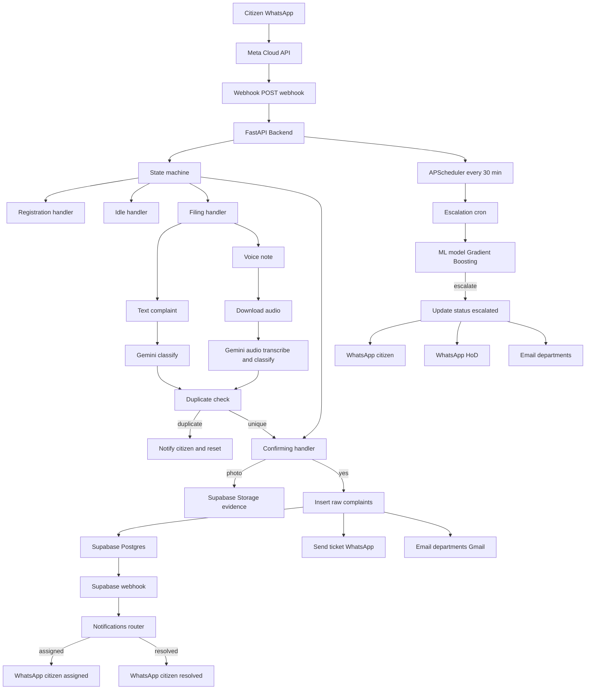

# Architecture -- Delhi PS-CRM

## System Overview

Delhi PS-CRM is a WhatsApp-based civic complaint management system. Citizens interact entirely through WhatsApp. The backend processes messages, classifies complaints using AI, stores data in Supabase, and auto-escalates unresolved issues using a trained ML model.

## Architecture



---

## Request Flow

### 1. Incoming Message

```
WhatsApp -> Meta Webhook -> POST /webhook -> FastAPI -> State Machine
```

1. A citizen sends a WhatsApp message (text, voice note, or image)
2. Meta's Cloud API delivers it to our `POST /webhook` endpoint
3. The webhook router extracts sender, text, type, media ID, and timestamp (for 30-second deduplication)
4. The **state machine** (`handlers/state_machine.py`) looks up the user's current state in Supabase and routes to the appropriate handler

### 2. Conversational State Machine

Users progress through these states:

| State           | Handler              | Description                                    |
|-----------------|----------------------|------------------------------------------------|
| `(new user)`    | `registration.py`    | Creates user row, collects name                |
| `registering`   | `registration.py`    | Awaiting name input                            |
| `idle`          | `idle.py`            | Accepts `new`, `status`, or rating (1-5)       |
| `filing`        | `filing.py`          | Collects complaint text or voice note, sends to Gemini AI |
| `confirming`    | `confirming.py`      | User reviews AI analysis, can attach photo     |
| `awaiting_photo`| `confirming.py`      | Accepts image upload to Supabase Storage       |

During the `confirming` state, sending **"no"** cancels the complaint and returns to `idle`.

### 3. AI Classification

When a user files a complaint, the text is sent to **Gemini 2.0 Flash** with a structured prompt. The AI returns:

- **Category**: Primary category (Waste Management, Water Supply, Sewage & Drainage, Roads, Electricity, Other)
- **Categories**: All relevant categories (multi-category support)
- **Urgency**: Low, Medium, High, Critical
- **Location**: Extracted from the complaint text
- **Ward**: Delhi municipal ward derived from the location
- **Summary**: One-sentence summary
- **Sentiment**: Neutral, Frustrated, Angry, Urgent

Gemini handles **Hindi, English, Urdu, Punjabi, Haryanvi, Bhojpuri, Hinglish, and other Indian regional languages** naturally -- no separate translation step is needed.

### 4. Complaint Submission

After the user confirms (replies "YES"), the complaint is inserted into the `raw_complaints` table with all AI-analyzed fields. The user receives a ticket ID (first 8 characters of the UUID). Email notifications are sent to all relevant department teams via Gmail SMTP.

---

## Voice Note Flow

Citizens can send voice notes in Hindi, English, Urdu, Punjabi, Haryanvi, Bhojpuri, Hinglish, or any mix of Indian regional languages.

1. User sends WhatsApp voice note during filing state
2. Webhook router extracts media_id from audio message
3. Filing handler downloads audio bytes from WhatsApp Cloud API using media_id
4. Audio bytes sent inline to Gemini 2.0 Flash with classification prompt
5. Gemini transcribes and classifies in a single API call -- returns transcription, category, urgency, location, ward, summary, sentiment
6. Duplicate check runs on AI-extracted category and location
7. Confirmation message sent to citizen including transcription for verification
8. Flow continues identically to text complaint path

Note: WhatsApp voice notes use audio/ogg with opus codec and Gemini handles this natively with no additional transcription service required.

---

## Escalation Flow

```
APScheduler (every 30 min) -> ML Model prediction -> Supabase update -> WhatsApp alert + Email
```

1. **APScheduler** triggers `run_escalation_check()` every 30 minutes
2. The cron job loads all unresolved complaints from Supabase
3. For each complaint, it computes a **cluster count** (how many complaints share the same category + location)
4. The **GradientBoosting model** receives three features: `status_encoded`, `urgency_encoded`, `cluster_count`
5. If the model predicts `1` (escalate), the complaint status is updated to `escalated`, the citizen receives a WhatsApp notification, and escalation emails are sent to all relevant departments

---

## Database Schema

### Supabase Tables

#### `users`

| Column            | Type      | Description                                     |
|-------------------|-----------|-------------------------------------------------|
| `id`              | UUID      | Primary key                                     |
| `whatsapp_number` | text      | User's WhatsApp number (unique)                 |
| `name`            | text      | User's registered name                          |
| `state`           | text      | Current conversation state                      |
| `state_data`      | jsonb     | Temporary data for the current flow (e.g. draft)|
| `created_at`      | timestamp | Registration timestamp                          |

#### `raw_complaints`

| Column            | Type        | Description                                       |
|-------------------|-------------|---------------------------------------------------|
| `id`              | UUID        | Primary key (ticket ID derived from first 8 chars) |
| `whatsapp_number` | text        | Complainant's WhatsApp number                     |
| `category`        | text        | AI-classified primary category                    |
| `categories`      | text[]      | All relevant AI-classified categories             |
| `urgency`         | text        | AI-classified urgency level                       |
| `location`        | text        | Extracted location                                |
| `ward`            | text        | Delhi municipal ward                              |
| `sentiment`       | text        | AI-detected sentiment                             |
| `summary`         | text        | AI-generated summary                              |
| `raw_message`     | text        | Original complaint text or transcription          |
| `status`          | text        | open, assigned, in_progress, escalated, resolved  |
| `photo_url`       | text        | Public URL to evidence photo (nullable)           |
| `assigned_to`     | text        | Assigned officer name (nullable)                  |
| `rating`          | integer     | Citizen satisfaction rating 1-5 (nullable)        |
| `timestamp`       | timestamptz | Complaint submission timestamp                    |

### Supabase Storage

| Bucket               | Access  | Description                              |
|-----------------------|---------|------------------------------------------|
| `complaint-evidence`  | Public  | Photo evidence uploaded by citizens       |

Files are stored at the path `{whatsapp_number}/{uuid}.{ext}`.

---

## Scalability

- **Stateless handlers**: All conversation state is stored in Supabase, not in memory. Any backend instance can handle any request.
- **Managed Postgres**: Supabase handles database scaling, backups, and connection pooling.
- **Horizontal scaling**: Deploy multiple instances on Railway behind a load balancer. The APScheduler job uses `replace_existing=True` to prevent duplicate escalation runs.
- **Async throughout**: All I/O (WhatsApp API calls, Supabase queries) uses `httpx` async HTTP client.
- **ML model caching**: The escalation model is loaded once and cached in memory for the process lifetime.
