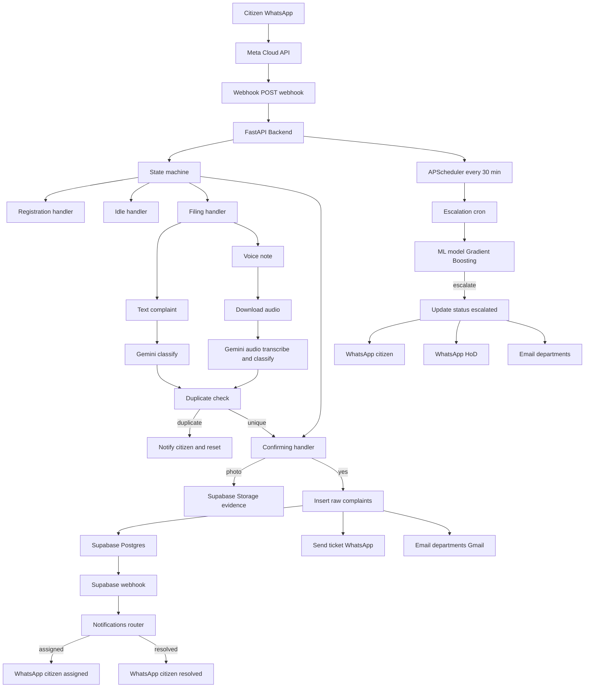

# Delhi PS-CRM

**WhatsApp-based civic complaint management system for Delhi.**

Citizens file complaints via WhatsApp in Hindi or English. The system uses Gemini AI to classify and extract structured data, stores everything in Supabase, and auto-escalates unresolved complaints using a trained ML model. This production backend replaces a previous n8n automation prototype.

Voice complaint filing -- citizens can send WhatsApp voice notes in Hindi or English. Gemini AI transcribes and classifies the audio in a single API call, with transcription shown to the citizen for verification before submission.

---

## Architecture



---

## Tech Stack Used

| Component                | Technology                        |
|--------------------------|-----------------------------------|
| Backend Framework        | FastAPI (Python 3.11+)            |
| Database & Auth          | Supabase (Postgres + Storage)     |
| AI Classification        | Google Gemini 2.0 Flash           |
| Messaging Channel        | WhatsApp Business API (Meta)      |
| Escalation Model         | GradientBoosting (scikit-learn)   |
| Email Notifications      | Gmail SMTP                        |
| Task Scheduling          | APScheduler (async, 30-min cycle) |
| Deployment               | Railway (Nixpacks)                |

---

## Repository Structure

```
Delhi-PS-CRM/
- delhi-ps-crm-backend/          # FastAPI backend
  - main.py                      # App entry point, lifespan, scheduler
  - config.py                    # Env var loading & validation, Supabase client
  - constants.py                 # Department emails, greetings, categories
  - requirements.txt             # Python dependencies
  - handlers/                    # Conversational state handlers
    - state_machine.py           # Routes messages by user state
    - registration.py            # New user registration
    - idle.py                    # Status check & new complaint trigger
    - filing.py                  # Complaint text, AI analysis, duplicate check
    - confirming.py              # Confirm, attach photo, submit
    - awaiting_photo.py          # WhatsApp image download, Supabase Storage
  - services/                    # External integrations
    - ai.py                      # Gemini AI complaint classifier
    - whatsapp.py                # WhatsApp Cloud API message sender
    - escalation.py              # ML model loader & predictor
    - escalation_cron.py         # Scheduled escalation job
    - email_service.py           # Gmail SMTP email notifications
    - storage.py                 # Supabase storage utilities
  - routers/                     # FastAPI route definitions
    - webhook.py                 # GET/POST /webhook for WhatsApp
    - notifications.py           # POST /notifications/assignment
  - models/                      # ML models & schemas
    - escalation_model.pkl       # Trained GradientBoosting model
    - schemas.py                 # Pydantic schemas
    - README.md                  # Model documentation
- delhi-ps-crm-dashboard.html    # Admin dashboard (standalone)
- index.html                     # Landing page
- ARCHITECTURE.md                # System architecture documentation
- DEMO.md                        # Demo walkthrough
- railway.toml                   # Railway deployment config
- .gitignore
```

---

## Deployment

The current implementation is deployed on Railway for demonstration purposes.

For production deployment at the scale of Delhi's civic infrastructure, the system is architected for Microsoft Azure:

- **Backend** -- Azure App Service or Azure Container Apps with auto-scaling
- **Database** -- migrate from Supabase to Azure Database for PostgreSQL
- **Storage** -- Azure Blob Storage for complaint photo evidence
- **ML Model** -- Azure Machine Learning for model serving and retraining pipelines
- **Messaging** -- Azure Service Bus for webhook event queuing under high load
- **Monitoring** -- Azure Monitor and Application Insights for observability

The stateless architecture ensures horizontal scaling with no re-engineering -- each instance reads and writes state exclusively through the database, with no local state maintained on any server.

---

## API Endpoints

| Method | Path                        | Description                                  |
|--------|-----------------------------|----------------------------------------------|
| GET    | `/`                         | Application status check                     |
| GET    | `/health`                   | Health check with version info               |
| GET    | `/webhook`                  | WhatsApp webhook verification (Meta handshake)|
| POST   | `/webhook`                  | Receive incoming WhatsApp messages           |
| POST   | `/notifications/assignment` | Officer assignment and resolution alerts     |

---

## License

MIT -- see [LICENSE](LICENSE) for details.
