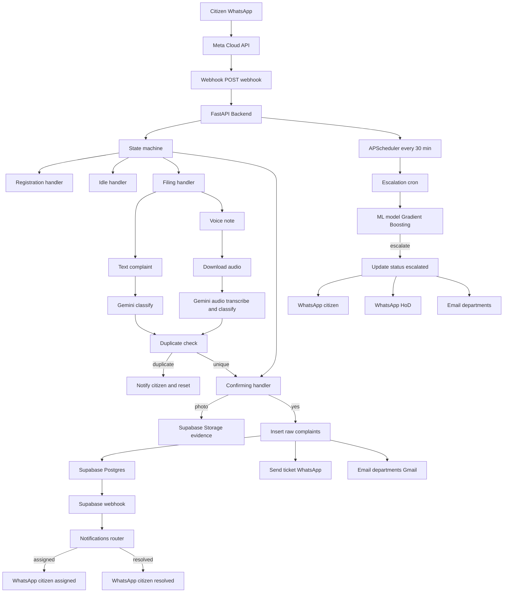

# Delhi PS-CRM

**AI-powered civic grievance management for Delhi -- file complaints in any language, get real-time updates, auto-escalation via ML.**

Citizens interact entirely through WhatsApp. No app downloads, no forms, no English literacy required. Speak or type a complaint in Hindi, English, Urdu, Punjabi, Haryanvi, Bhojpuri, Hinglish, or any mix -- Gemini AI understands, classifies, and routes it to the right department. A trained ML model auto-escalates unresolved complaints. Officers manage everything through a real-time admin dashboard.

---

## Resources

- [Demo Video](https://youtu.be/-ijPRAcV_T0?si=4b6ALCIpxPtBtqHP)
- [Project Drive](https://drive.google.com/drive/folders/1b-VXsEavW6BJ71RT0Z1fzjyHT-kOoPHo)
- [ML Model — Google Colab](https://colab.research.google.com/drive/1eMmbXmLwrAfmpn6QCj4pGfKrsuKsjtQl?usp=sharing)
- [Cost Quotation Sheet](https://docs.google.com/spreadsheets/d/1Bt7-JaH7GhQL478bQmCY_5DWysrhF641/edit?usp=drivesdk&ouid=114737713209928965969&rtpof=true&sd=true)
- [Live Dashboard](https://project-tf415.vercel.app)

---

## From Prototype to Production

This system was originally prototyped using n8n automation workflows to validate the core complaint filing and routing logic. Once the prototype was validated, we rebuilt the entire backend as a production-grade Python FastAPI system with proper state management, ML-based escalation, voice note support, and a real-time admin dashboard.

The n8n prototype enabled rapid iteration. The FastAPI backend enables scale.

---

## The Problem

Delhi has over 20 million citizens and no accessible, unified digital grievance system that works for everyone.

- **Existing systems require app downloads**, English literacy, and reliable internet access -- excluding a large portion of the population
- **Complaints fall through the cracks** with no tracking, no accountability, and no follow-up
- **No automated prioritization** -- critical issues sit in the same queue as minor requests
- **Citizens have no visibility** into whether their complaint was received, assigned, or resolved
- **Departments operate in silos** -- a complaint involving multiple departments (e.g., sewage overflow on a road) gets lost between teams

---

## Our Solution

| Capability | Description |
|---|---|
| **WhatsApp-based** | Zero app download, works on any phone with WhatsApp |
| **Multilingual** | Hindi, English, Urdu, Punjabi, Haryanvi, Bhojpuri, Hinglish, and more |
| **Voice notes** | Citizens speak their complaint -- Gemini transcribes and classifies in one API call |
| **AI classification** | Gemini 2.5 Flash-Lite extracts category, urgency, location, ward, sentiment automatically |
| **ML escalation** | Gradient Boosting model auto-escalates based on status, urgency, and cluster count |
| **Real-time dashboard** | Officers manage complaints via Kanban board, geospatial map, and analytics |
| **Department routing** | Complaints routed to correct department email automatically -- multi-department support |
| **Full accountability** | Officer assignment tracked, resolution notes required, citizen rating system (1-5) |

---

## Architecture



---

## Demo Video


https://github.com/user-attachments/assets/4f3f0c8d-f32a-425c-a977-d4e263168ab7

https://github.com/user-attachments/assets/c0e72420-5510-42eb-8a0d-8184e6ceb171

https://github.com/user-attachments/assets/bf4676bb-6c87-47c9-96d0-68c3e41734ea


---

## Tech Stack Used

| Component                | Technology                        |
|--------------------------|-----------------------------------|
| Backend Framework        | FastAPI (Python 3.11+)            |
| Admin Dashboard          | Next.js 16.2.4, Tailwind CSS, Recharts, Leaflet |
| Database & Auth          | Supabase (Postgres + Storage)     |
| AI Classification        | Google Gemini 2.5 Flash-Lite           |
| Messaging Channel        | WhatsApp Business API (Meta)      |
| Escalation Model         | GradientBoosting (scikit-learn)   |
| Email Notifications      | Gmail SMTP                        |
| Task Scheduling          | APScheduler (async, 30-min cycle) |
| Deployment               | Railway (backend), Vercel (dashboard)                |

---

## Key Features

- **Complaint filing via text or voice note** in any Indian language -- Hindi, English, Urdu, Punjabi, Haryanvi, Bhojpuri, Hinglish, and more
- **Gemini AI extracts category, urgency, ward, location, sentiment** in a single API call -- no separate translation or NLP pipeline
- **Duplicate complaint detection** prevents redundant filings by matching category + location against existing open complaints
- **Photo evidence upload** to Supabase Storage with automatic linking to the complaint record
- **Multi-department routing** -- one complaint can notify multiple departments simultaneously (e.g., Roads + Water Supply)
- **Gradient Boosting ML model (F1: 0.9273)** for auto-escalation based on status, urgency, and geographic clustering
- **APScheduler runs escalation check every 30 minutes** -- no manual intervention required
- **Real-time WhatsApp notifications** for officer assignment and complaint resolution
- **Citizen rating system (1-5)** after complaint resolution -- feedback loop for service improvement
- **Admin dashboard with Kanban board**, geospatial map view, analytics charts, and officer accountability tracking
- **Drag-and-drop Kanban** with modal confirmation for officer assignment and resolution notes
- **Export complaints as CSV** for offline analysis and reporting
- **30-second webhook deduplication** prevents Meta retry spam from creating duplicate processing

---

## Repository Structure

```
Delhi-PS-CRM/
- delhi-ps-crm-backend/          # FastAPI backend
  - main.py                      # App entry point, lifespan, scheduler
  - config.py                    # Env var loading & validation, Supabase client
  - constants.py                 # Department emails, greetings, categories
  - requirements.txt             # Python dependencies
  - handlers/                    # Conversational state handlers
    - state_machine.py           # Routes messages by user state
    - registration.py            # New user registration
    - idle.py                    # Status check, new complaint, rating
    - filing.py                  # Complaint text/voice, AI analysis, duplicate check
    - confirming.py              # Confirm, attach photo, submit
    - awaiting_photo.py          # WhatsApp image download, Supabase Storage
  - services/                    # External integrations
    - ai.py                      # Gemini AI complaint classifier
    - whatsapp.py                # WhatsApp Cloud API message sender
    - escalation.py              # ML model loader & predictor
    - escalation_cron.py         # Scheduled escalation job
    - email_service.py           # Gmail SMTP email notifications
    - storage.py                 # Supabase storage utilities
  - routers/                     # FastAPI route definitions
    - webhook.py                 # GET/POST /webhook for WhatsApp
    - notifications.py           # POST /notifications/assignment
  - models/                      # ML models & schemas
    - escalation_model.pkl       # Trained GradientBoosting model
    - schemas.py                 # Pydantic schemas
    - README.md                  # Model documentation
- delhi-ps-crm-dashboard/        # Next.js admin dashboard
- ARCHITECTURE.md                # System architecture documentation
- DEMO.md                        # Demo walkthrough
- railway.toml                   # Railway deployment config
```

---

## How It Works

1. Citizen sends a WhatsApp message in any language -- text or voice note
2. Meta Cloud API delivers the webhook to the FastAPI backend
3. The state machine routes the message to the appropriate handler
4. Gemini AI classifies the complaint -- category, urgency, ward, location, sentiment extracted in one API call
5. Complaint is stored in Supabase and the concerned department is notified via email
6. Admin assigns an officer via the dashboard -- citizen receives WhatsApp notification
7. Officer resolves the complaint with resolution notes -- citizen is prompted to rate experience 1 to 5
8. ML model runs every 30 minutes -- auto-escalates based on status, urgency, and cluster count -- HoD alerted via WhatsApp and email

---

## Deployment

The current implementation is deployed on Railway for demonstration purposes.

For production deployment at the scale of Delhi's civic infrastructure, the system is architected for Microsoft Azure:

- **Backend** -- Azure App Service or Azure Container Apps with auto-scaling
- **Database** -- migrate from Supabase to Azure Database for PostgreSQL
- **Storage** -- Azure Blob Storage for complaint photo evidence
- **ML Model** -- Azure Machine Learning for model serving and retraining pipelines
- **Messaging** -- Azure Service Bus for webhook event queuing under high load
- **Monitoring** -- Azure Monitor and Application Insights for observability

The stateless architecture ensures horizontal scaling with no re-engineering -- each instance reads and writes state exclusively through the database, with no local state maintained on any server.

---

## API Endpoints

| Method | Path                        | Description                                  |
|--------|-----------------------------|----------------------------------------------|
| GET    | `/`                         | Application status check                     |
| GET    | `/health`                   | Health check with version info               |
| GET    | `/webhook`                  | WhatsApp webhook verification (Meta handshake)|
| POST   | `/webhook`                  | Receive incoming WhatsApp messages           |
| POST   | `/notifications/assignment` | Officer assignment and resolution alerts     |

---

## Team

Built by **Team 5Baddies, NSUT**


---

## License

MIT -- see [LICENSE](LICENSE) for details.
